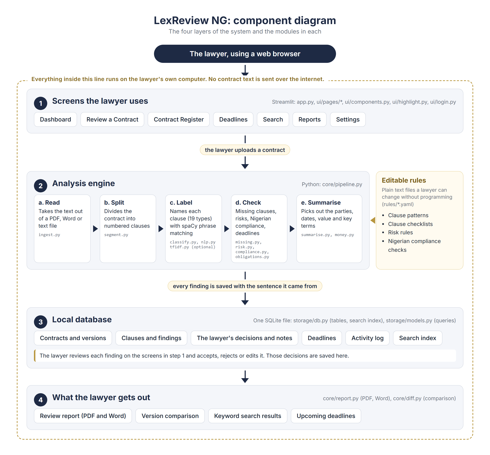
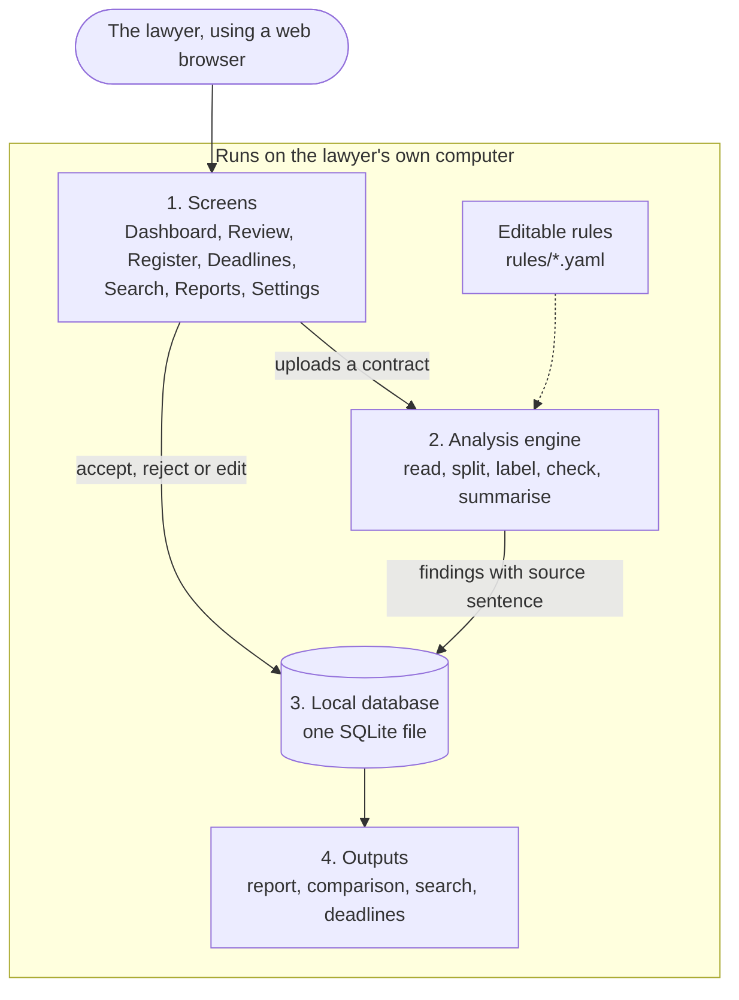
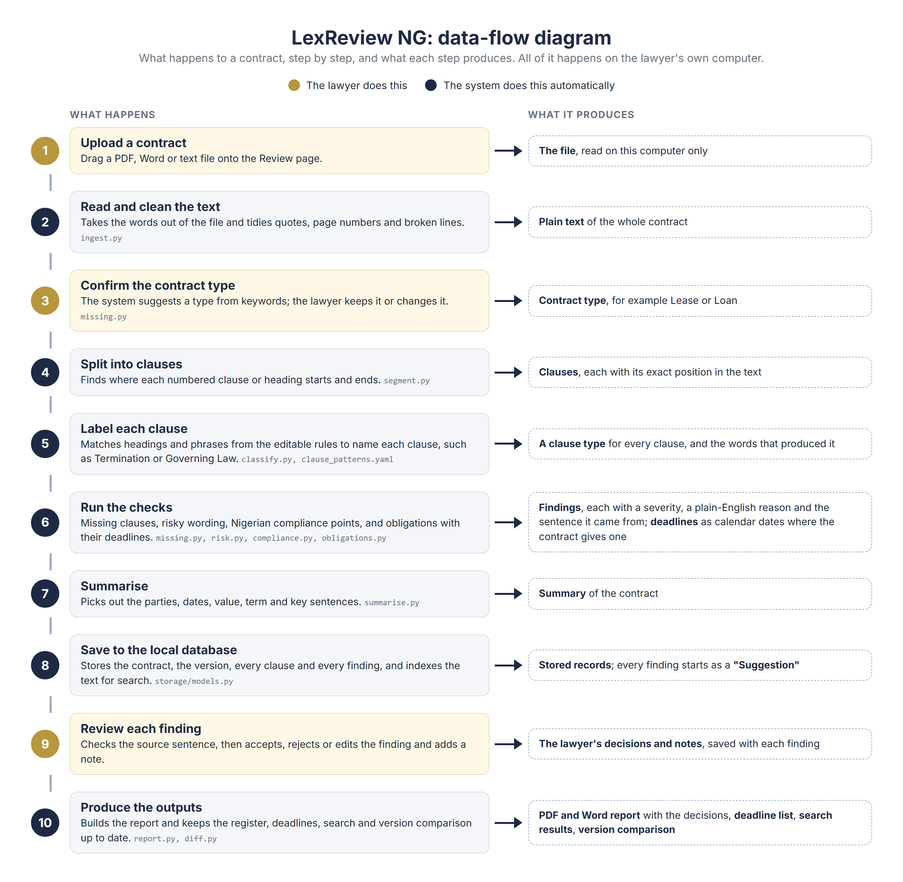
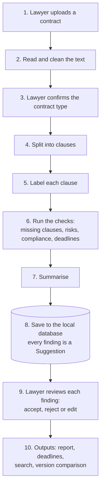

# LexReview NG: system architecture

This document describes how we designed and built LexReview NG, the prototype at the centre of our Master's capstone, "AI-Driven Contract Review and Management System Developed with Python NLP Libraries for Nigerian Law Firms". We followed Design Science Research, so the prototype is our design artefact. We demonstrate it with synthetic contracts rather than evaluating it formally; a precision and recall study is left for future work.

Everything we describe here runs on one computer. No contract text is sent to any external service, cloud model or API, and the app collects no telemetry.

## 1. What the system does

A lawyer uploads a contract (PDF, Word or plain text). The system then:

1. extracts and cleans the text and splits it into numbered clauses,
2. labels each clause with one of 19 clause types (or "Other"),
3. checks the contract against a checklist of clauses expected for its type and reports gaps,
4. flags risky wording with a severity (High, Medium or Low) and a plain-English reason,
5. runs indicative Nigerian compliance checks,
6. extracts obligations, the party who owes them, and deadlines, converting them to calendar dates where the contract gives an anchor date,
7. builds an extractive summary,
8. stores the contract, every version, every finding and the lawyer's decisions in a local SQLite register,
9. supports keyword search, clause-level version comparison and PDF or Word report export.

Every finding is shown as a suggestion, always next to the sentence it came from, and the lawyer can accept, reject or edit it. Nothing is treated as decided until a lawyer decides it.

## 2. Architecture overview

We organised the code in four layers so that each part can be explained, tested and changed on its own:

- **Presentation** (`app.py`, `ui/`): a Streamlit app with seven pages, shared components, the contract text highlighter and an optional lock screen.
- **Analysis core** (`core/`): plain Python modules with no Streamlit code. Each module does one job (ingest, segment, classify and so on) and `core/pipeline.py` runs them in order.
- **Rules** (`rules/`): four YAML files that hold every pattern, checklist, risk rule and compliance check. A non-programmer can open them in a text editor, read the comments at the top, and change how the system behaves without touching Python.
- **Storage** (`storage/`): one SQLite file with the contract register, versions, clauses, findings, obligations, an activity log and a full-text search index.

### Component diagram

The diagram shows the four layers from the lawyer's point of view. The lawyer works in the screens (1). Uploading a contract sends it through the analysis engine (2), which reads the editable rules and produces findings. Every finding is saved in the local database (3) together with the sentence it came from, and the lawyer's decisions are saved there too. The outputs (4) are built from what is stored. All of it sits inside one boundary: the lawyer's own computer.

The same structure as Mermaid text, for anyone who wants to edit it in a Markdown tool:

### Data-flow diagram

Read the diagram from top to bottom. The gold steps are the ones the lawyer does (uploading, confirming the contract type and reviewing the findings); the navy steps happen automatically. The right-hand column shows the data each step hands on to the next. Two points matter for the design: every finding keeps the sentence it came from, so the lawyer can always check it, and every finding starts as a "Suggestion" until the lawyer decides.

As Mermaid text:

The editable HTML sources of both images are in `docs/diagrams/`; after changing the wording, `python scripts/render_diagrams.py` re-renders the PNG files.

## 3. How each step works

We deliberately chose rule-based techniques and spaCy pattern matching so that every result can be traced back to a rule a person can read. This matters for trust, which was the weakest attitude in our survey (72% agreed they would trust such a tool).

**Ingestion** (`core/ingest.py`). pdfplumber reads PDF text, python-docx reads Word paragraphs and tables, and plain text is decoded as UTF-8 with a Windows-1252 fallback. Cleaning turns curly quotes and long dashes into plain characters, removes "Page x of y" lines, rejoins words broken across lines, and keeps the line structure, because the clause splitter depends on it.

**Segmentation** (`core/segment.py`). The splitter walks the text line by line and starts a new clause at top-level numbers ("1."), second-level numbers ("1.1"), keyword numbers ("Clause 5:", "Article 3") and stand-alone capitalised headings ("GOVERNING LAW"). List items such as "(a)" stay inside their clause. The first line of the document is treated as its title, and everything before the first clause becomes the preamble. Every clause keeps its exact character offsets in the cleaned text, which is what lets the interface jump from a finding to its sentence.

**Clause identification** (`core/classify.py`, `rules/clause_patterns.yaml`). Each of the 19 labels has heading keywords and characteristic phrases (199 phrases in total). We use spaCy's PhraseMatcher on lower-cased tokens to find the phrases. A clause's own heading counts three times as much as a phrase; a heading inherited from a parent clause counts like a single phrase, so a sub-clause's own wording can win. The highest score wins and a score of zero means "Other". Some labels only apply to certain contract types (rent to leases, repayment to loans, service levels to SLAs and supply agreements). The interface can show, for any clause, exactly which keywords and phrases produced its label.

**Optional statistical fallback** (`core/tfidf.py`). When switched on in Settings, a TF-IDF and logistic regression model, trained in memory on 190 synthetic example clauses in `data/training/clauses.yaml`, suggests a label for clauses the rules left as "Other". It only ever replaces "Other", it shows its confidence, and it is off by default. We did not add a transformer model: it would need a large download and would be much harder to explain, which works against the transparency requirement.

**Missing clauses** (`core/missing.py`, `rules/checklists.yaml`). Each of the seven contract types (employment, commercial supply, lease, NDA, partnership, service level and loan) has a list of expected clauses with a one-line reason for each. The contract type is detected from keywords, with words in the title counting five times as much, and the lawyer can override it. Missing governing law, dispute resolution, termination or data protection clauses are High severity; the rest are Medium.

**Risk analysis** (`core/risk.py`, `rules/risk_rules.yaml`). There are 12 rules built from seven small rule types: a pattern, a pattern unless another phrase appears in the same clause, a missing label, a label whose text lacks something (for example a governing law clause that does not mention Nigeria), personal data mentioned without a data protection clause, an interest rate above a threshold, and a balance check that looks at who may terminate or who gives an indemnity across the whole contract. The rules cover uncapped liability, one-sided indemnity, termination without notice, one-sided termination, automatic renewal without notice, foreign or missing governing law, foreign-seated arbitration, missing dispute resolution, personal data without a data protection clause, high interest and penalty clauses.

**Nigerian compliance** (`core/compliance.py`, `rules/nigeria_compliance.yaml`). Seven indicative checks: Nigerian governing law, a reference to the Nigeria Data Protection Act 2023 where personal data appears, a reference to the Arbitration and Mediation Act 2023 where arbitration is chosen, a stamp duty and registration reminder for leases and loans, and for employment contracts a Labour Act reference, a stated notice period and a termination clause. Each result says it is an indicative check and not legal advice.

**Obligations and deadlines** (`core/obligations.py`). Sentences containing "shall", "must", "will", "agrees to" or "undertakes to" are candidates. The obligated party is matched against the roles the contract defines for itself ("hereinafter referred to as the Lender"). Periods such as "within 30 days of the Drawdown Date" are resolved against anchor dates found in the text (the date of the agreement, the commencement date, defined dates such as the Drawdown Date, and the expiry date), including business days. A period tied to an event we cannot date, such as "the effective date of termination", deliberately gets no due date rather than a wrong one.

**Summary** (`core/summarise.py`, `core/money.py`). The summary is extractive: parties and roles, key dates, the largest Naira amount, the term, one key sentence each for payment, rent, repayment, termination, governing law and dispute resolution, and the top risks and obligations. Money is parsed into integer kobo and never stored as a floating-point number.

**Version comparison** (`core/diff.py`). Clauses of two versions are aligned by clause number (or heading) using Python's difflib, then changed clauses get a word-level diff. All contract text is HTML-escaped before highlighting.

**Reports** (`core/report.py`). The same report data feeds a PDF (reportlab) and a Word document (python-docx): a cover block with the firm name, the disclaimer, the summary, clauses, missing clauses, risks, compliance, obligations and a table of the lawyer's decisions.

## 4. Data model

| Table | Purpose |
|-------|---------|
| contracts | One row per contract: title, type, parties, status (Draft, Under Review, Executed, Active, Expiring, Terminated), key dates, value in kobo and currency |
| versions | Every uploaded version with its full text |
| clauses | Clauses of a version with number, heading, label and offsets |
| findings | Every suggestion (clause, missing, risk, compliance, obligation) with severity, reason, source excerpt, offsets and the lawyer's decision, note and edited text |
| obligations | Party, obligation text, period and due date |
| activity | An audit trail of uploads, decisions, status changes, exports and deletions |
| search_index | An SQLite FTS5 index over version text, kept in sync by triggers |

Identifiers are random UUIDs rather than counting numbers. Deleting a contract cascades to its versions, clauses, findings, obligations, activity and search entries. SQLite's secure delete setting overwrites the freed space in the file, and the search index is set to forget deleted words as well, so a deleted contract's text cannot be read back out of the database file. A test checks the raw bytes of the file after a delete to prove it.

## 5. Mapping survey priorities to modules

| Feature | Survey "Yes" | Implemented in | Where the lawyer sees it |
|---------|-------------:|----------------|--------------------------|
| Automatic clause identification | 96.9% | `core/segment.py`, `core/classify.py`, `rules/clause_patterns.yaml` | Review: Clauses tab and tinted text pane |
| Missing clause detection | 93.2% | `core/missing.py`, `rules/checklists.yaml` | Review: Missing clauses tab |
| Risk analysis | 93.1% | `core/risk.py`, `rules/risk_rules.yaml` | Review: Risks tab, Dashboard chart |
| Compliance checking (Nigerian law) | 87.2% | `core/compliance.py`, `rules/nigeria_compliance.yaml` | Review: Nigerian compliance tab |
| Contract summarisation | 84.4% | `core/summarise.py`, `core/money.py` | Review: Summary tab, reports |
| Deadline reminders | 83.8% | `core/obligations.py`, `storage/models.py` | Deadlines page, Dashboard |
| Smart document storage | 82.9% | `storage/db.py`, `storage/models.py` | Contract Register |
| Report generation | 82.2% | `core/report.py` | Reports page |
| Keyword search | 78.2% | `storage/db.py` (FTS5), `storage/models.py` | Search page |
| Version control | 75.4% | `storage/models.py`, `core/diff.py` | Register: contract detail |
| AI supports, not replaces, lawyers | 88.5% | `findings.status`, `ui/components.py` | Accept, Reject, Edit and notes on every finding |
| Data privacy and security | 85% and 97.2% | Local SQLite, no network calls, `core/auth.py`, delete controls | Sidebar badge, Settings |

## 6. Security and privacy

- All processing is local. The app makes no network calls at runtime, Streamlit's usage statistics are switched off, and the Inter font is bundled so even fonts load offline.
- The app only listens on this computer (`localhost`), so other machines on the office network cannot open it.
- All SQL uses parameters. User search terms are reduced to letters and digits and quoted word by word before they reach FTS5, so they can never become query syntax.
- Contract text is HTML-escaped everywhere it is shown, including the text pane, diffs, search snippets and reports.
- The optional lock screen stores only a salted scrypt hash of the password, in `data/local_config.yaml`, which is excluded from Git. Five wrong attempts trigger a 30 second lockout for the whole app, not just one browser tab.
- A lawyer can delete one contract with all its data, or wipe everything from Settings.

## 7. Interface design

We designed the interface around four survey findings.

**Ease of use (91.3% said an easy interface would drive adoption).** The app has one job per page and seven pages in a fixed sidebar. Every page opens with a title, one sentence saying what it is for and, where it makes sense, one primary action. The colour palette is restrained (deep navy, a little muted gold, white and light grey), the type scale is fixed (28px page titles, 20px sections, 15px body text) and there are clear empty states, for example "No contracts yet. Upload your first contract to begin."

**Trust (only 72% agreed they would trust such a tool).** Trust was the weakest attitude, so the interface never asks the lawyer to take a result on faith. Every finding card shows the plain-English reason and the exact source sentence, and "Show in text" scrolls the contract pane to that sentence and highlights it. Clause labels can be traced to the keywords that produced them. Severity is always shown as a word as well as a colour (High red, Medium amber, Low blue, Pass green), which also helps colour-blind users.

**Security (97.2%) and privacy (85%).** A small badge in the sidebar says "Runs locally. Your documents never leave this computer.", and it is true: nothing leaves the machine. Settings shows where the database file lives and offers the delete and lock controls.

**Human oversight (88.5% said AI should support lawyers, not replace them).** Every finding starts as a "Suggestion" and stays labelled that way until a lawyer accepts, rejects or edits it. A progress bar shows how many findings have been reviewed, and the exported report records each decision and note. A short disclaimer, "Assists contract review. Does not give legal advice.", is always visible in the sidebar and printed on every report page.

## 8. Known limitations

- **No formal evaluation yet.** Following our methodology, we demonstrate the artefact on seven synthetic contracts. We have not measured precision or recall on real contracts; that is future work.
- **Rules are only as good as their wording.** Clause labels and risks depend on keywords and phrases. Unusual drafting, heavy cross-referencing or clauses that mix several topics can be mislabelled. A few clauses in our own samples are labelled imperfectly (for example a supply clause tagged as a service level), and we chose to leave them visible rather than tune the rules to the demo.
- **The statistical fallback is weak.** The optional TF-IDF model learns from only 190 synthetic sentences, so its suggestions are often wrong. That is why it is off by default, only replaces "Other", and always shows its confidence.
- **Layout-dependent extraction.** Scanned PDFs need OCR, which we do not include. Multi-column layouts, tables of defined terms and footnotes may come out in the wrong order.
- **Dates need an anchor.** A deadline is only converted to a date when the contract states the anchor date. Periods tied to events (such as termination or a written request) are listed without a due date.
- **Compliance checks are indicative.** They look for references and clauses; they do not interpret the law, and they need updating when the law changes.
- **Single user on one computer.** There are no user accounts, roles or shared access, and the optional password is a lock screen rather than full access control. The database file is not encrypted at rest, so the computer's own disk encryption matters.
- **English only.** The patterns assume English-language contracts.
