# Demonstration script

We use this script to demonstrate LexReview NG feature by feature for Chapter Four. It uses only the synthetic sample contracts in `data/samples/`, so it can be repeated on any computer. Each step says what to do, what to point out, and which screenshot in `docs/screenshots/` shows it.

To regenerate every screenshot after a change, run `python scripts/screenshots.py`. It starts its own copy of the app on a temporary database, so it never touches real data.

## Before you start

1. Install and start the app as described in the README (`streamlit run app.py`).
2. Open **Settings** and click **Load sample contracts**. This analyses and stores the seven synthetic contracts: employment, commercial supply, lease, NDA, partnership, service level and loan agreements.

The sample dates run from September 2026 onwards, so most deadlines appear as upcoming. Each sample has risky or missing clauses planted on purpose; `data/samples/expected.yaml` lists them.

## 1. Dashboard

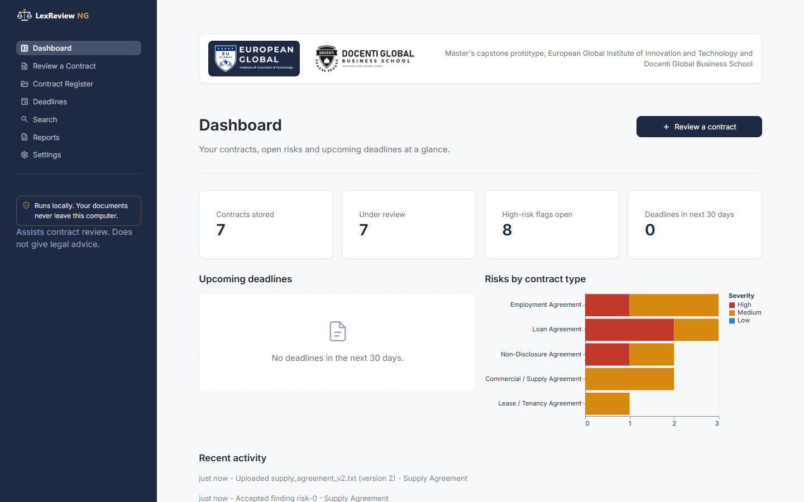

The Dashboard is the landing page. At the top are the logos of the European Global Institute of Innovation and Technology and Docenti Global Business School. Below them are four KPI cards (contracts stored, contracts under review, open high-risk flags and deadlines in the next 30 days), the list of upcoming deadlines, a bar chart of open risks by contract type, and recent activity.

Point out the sidebar badge, "Runs locally. Your documents never leave this computer.", and the disclaimer under it. Both respond directly to the privacy (85%) and security (97.2%) concerns in our survey.

## 2. Uploading a contract

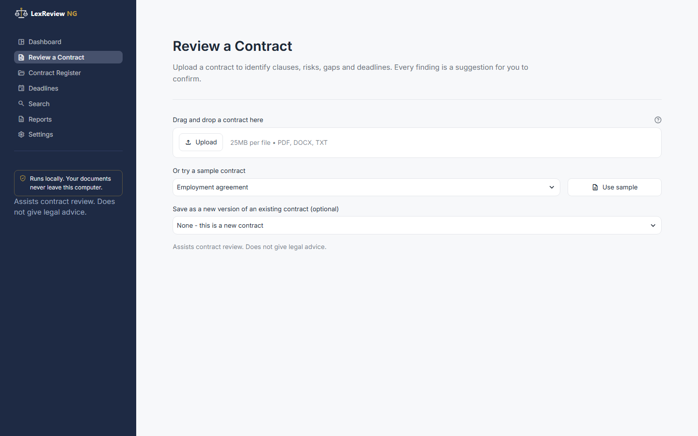

Open **Review a Contract**. Drag a PDF, Word or text file onto the upload area, or choose a sample from the list. The contract type is detected automatically and can be changed, and the title can be edited. The lawyer can also save the upload as a new version of an existing contract. Click **Analyse contract**; a short progress panel explains each stage while the analysis runs.

## 3. The review workspace and summary (summarisation, 84.4%)

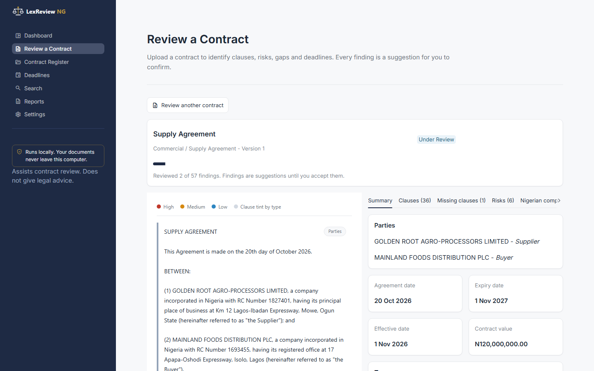

Open the Supply Agreement. The left pane shows the full contract. Each clause has a coloured left border for its type and a small label, and clauses that contain a risk are outlined in the severity colour. The right pane starts on the **Summary** tab: parties and their roles, the agreement, effective and expiry dates, the contract value in Naira, the term, one key sentence each for payment, termination, governing law and dispute resolution, then the top risks and obligations. The progress bar above counts how many findings the lawyer has reviewed.

## 4. Clause identification (96.9%)

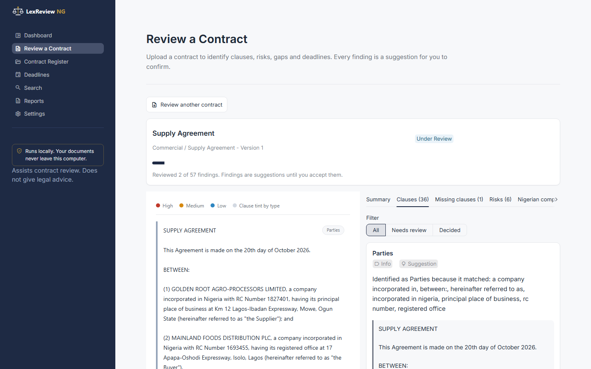

The **Clauses** tab lists every clause the system recognised, with the reason it chose that label (the heading keywords and phrases it matched). This is how we make the logic transparent: a lawyer can see why a clause was called "Limitation of Liability" and disagree with it.

## 5. Missing clause detection (93.2%)

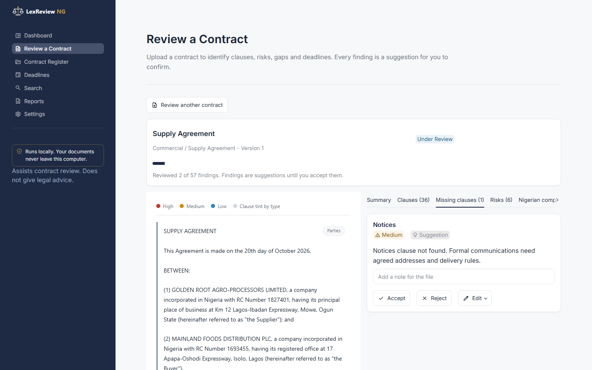

The **Missing clauses** tab compares the contract with the checklist for its type. The Supply Agreement has no notices clause, so it appears here with a one-line reason. Other good examples are the Employment Agreement (no dispute resolution clause) and the Lease (no assignment or subletting clause).

## 6. Risk analysis (93.1%) and "Show in text"

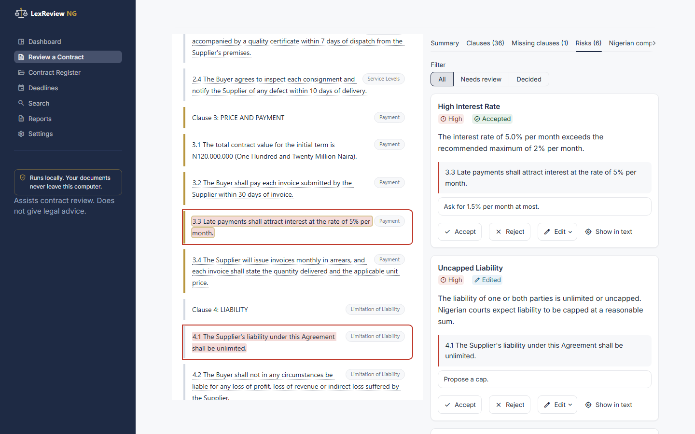

The **Risks** tab is the heart of the demonstration. The Supply Agreement raises six risks: late payment interest of 5% per month, unlimited liability, English governing law, London-seated arbitration, a one-sided indemnity and automatic renewal without notice. Each card shows the severity as a word and a colour, the plain-English reason, the source sentence, and Accept, Reject and Edit buttons with a notes field.

Click **Show in text** on a card. The left pane scrolls to that sentence and highlights it. This is the feature we rely on most for trust: nothing is asserted without the sentence that supports it.

Then accept one finding with a note, edit another (for example, propose "Liability capped at the Contract Value"), and reject a third. Each card's badge changes from "Suggestion" to the decision, and the progress bar moves.

## 7. Nigerian compliance (87.2%)

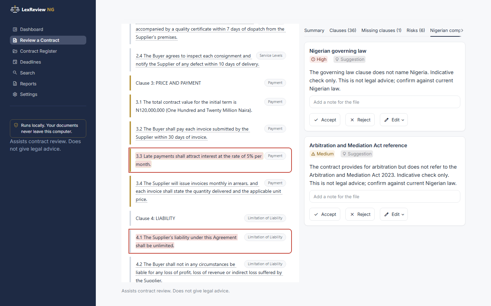

The **Nigerian compliance** tab shows the indicative checks that apply to this contract type, each with a pass or a flag, the reason, and the statute it refers to. For the Supply Agreement, the governing law check fails (English law) and the arbitration clause does not refer to the Arbitration and Mediation Act 2023. Every result ends with the reminder that it is an indicative check and not legal advice. For contrast, open the Service Level Agreement, which passes its governing law, Nigeria Data Protection Act 2023 and Arbitration and Mediation Act checks.

## 8. Obligations and deadlines (83.8%)

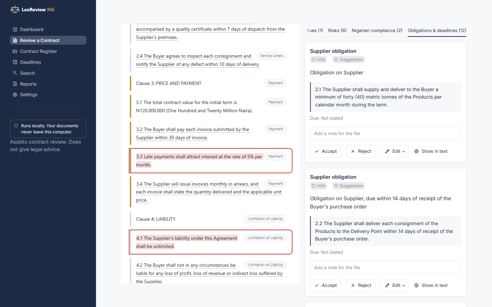

The **Obligations & deadlines** tab lists each duty, the party who owes it, the period, and a calculated due date where the contract gives an anchor date. The Loan Agreement is the clearest example: "The first instalment shall fall due within 30 days of the Drawdown Date", with the Drawdown Date of 15 November 2026, gives a due date of 15 December 2026.

## 9. Contract register (82.9%)

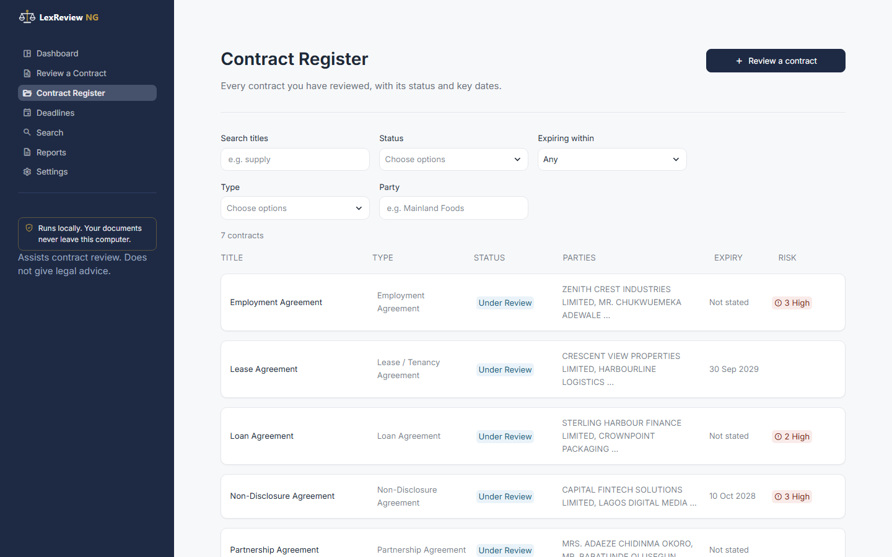

The **Contract Register** lists every stored contract with its type, status pill, parties, expiry date and open high-risk count. It can be filtered by title, type, status, party and expiry window. Clicking a title opens the contract.

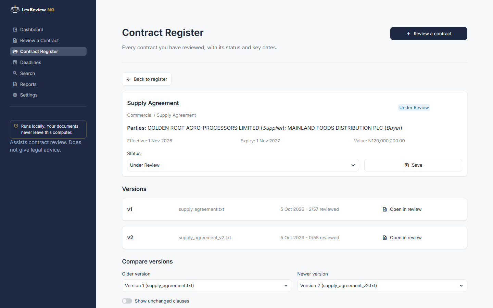

The detail view shows the contract's parties, dates and value, lets the lawyer change its status (Draft, Under Review, Executed, Active, Expiring, Terminated), and lists its versions with their review progress.

## 10. Version control (75.4%)

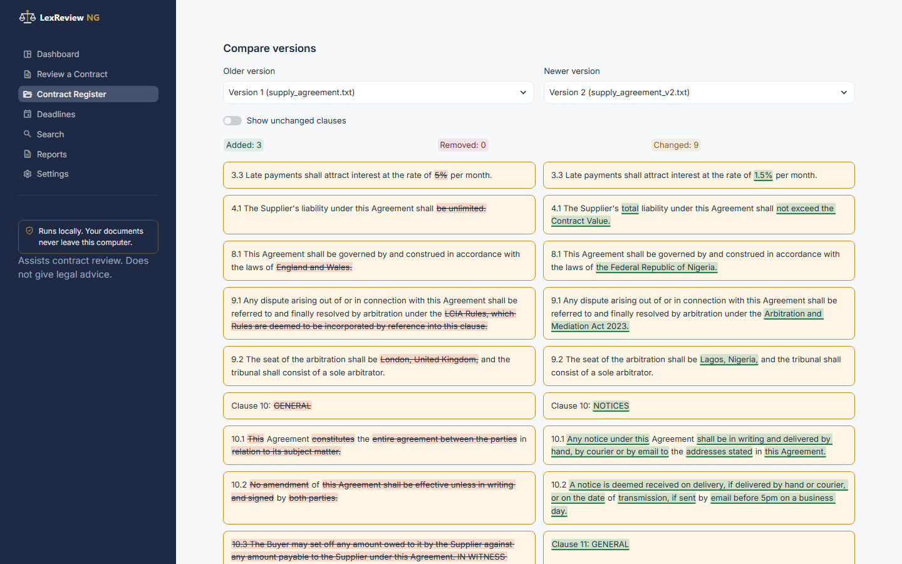

To show this live, upload `data/samples/versions/supply_agreement_v2.txt` from the Review page and choose "Save as a new version" of the Supply Agreement. The negotiated version caps liability, reduces late payment interest to 1.5% per month, moves governing law to Nigeria, moves arbitration to Lagos under the Arbitration and Mediation Act 2023, and adds a notices clause. In the register, the comparison counts added, removed and changed clauses and shows them side by side, with inserted words underlined in green and removed words struck through in red.

## 11. Deleting a contract (privacy)

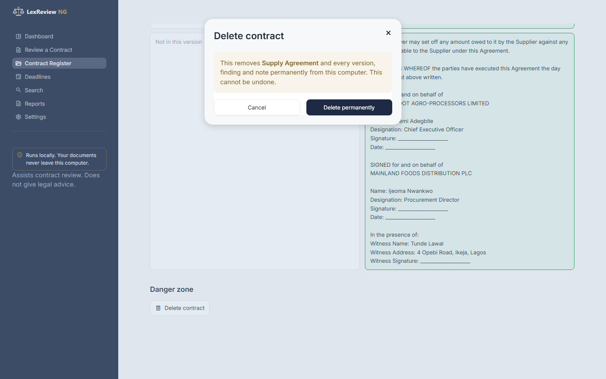

At the bottom of the detail view, **Delete contract** asks for confirmation and explains that every version, finding and note will be removed from this computer. Settings also has **Delete all data**, which only works after typing DELETE.

## 12. Deadlines dashboard

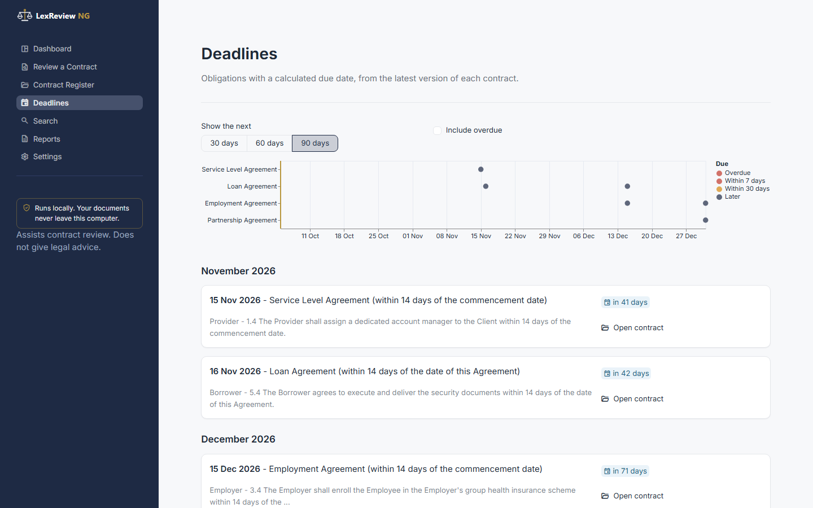

The **Deadlines** page shows a timeline and a month-by-month list of dated obligations, with 30, 60 and 90 day filters and an option to include overdue items. Each entry links back to its contract.

## 13. Keyword search (78.2%)

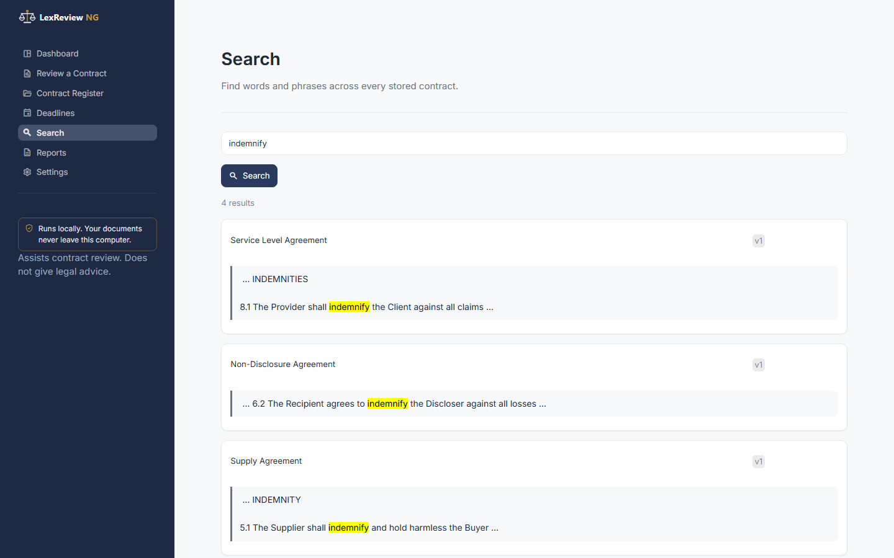

Search for "indemnify". The results show each contract and version with the matching words highlighted in context. Search uses a full-text index inside the local database, so nothing leaves the computer.

## 14. Report generation (82.2%)

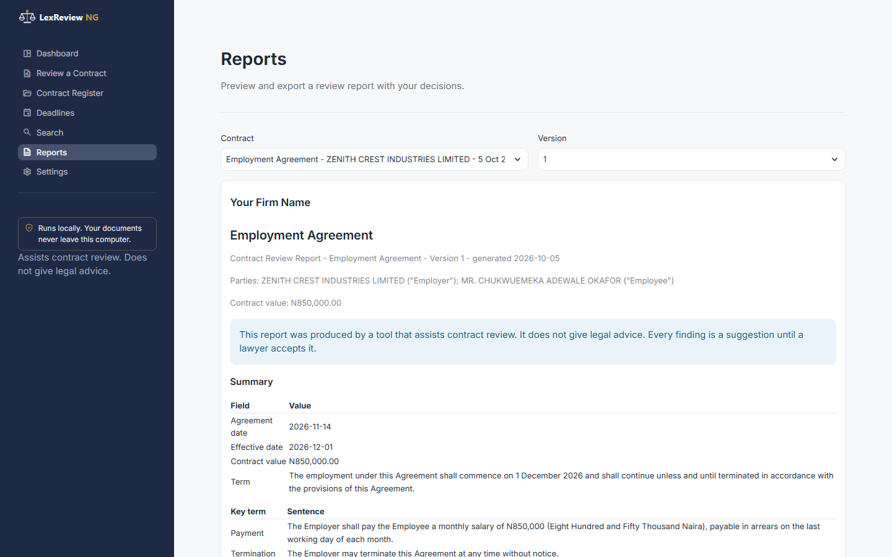

On **Reports**, choose a contract and version to preview the report: a cover block with the firm name, the disclaimer, then the summary, clauses, missing clauses, risks, compliance checks, obligations and the lawyer's decisions with their notes. **Export PDF** and **Export Word** download the same report. The firm name comes from Settings.

## 15. Settings

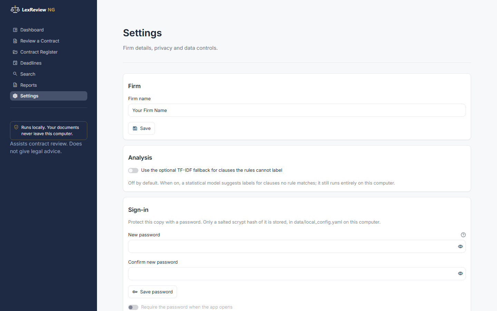

Settings holds the firm name used on reports, the optional TF-IDF fallback (off by default), the optional password lock (only a salted hash is stored), the location of the local database file, the sample loader and the delete controls.

## Closing point for the demonstration

Every finding started as a suggestion and became a decision only when we made it. That is the design principle our survey respondents asked for: 88.5% said AI should support lawyers rather than replace them.
