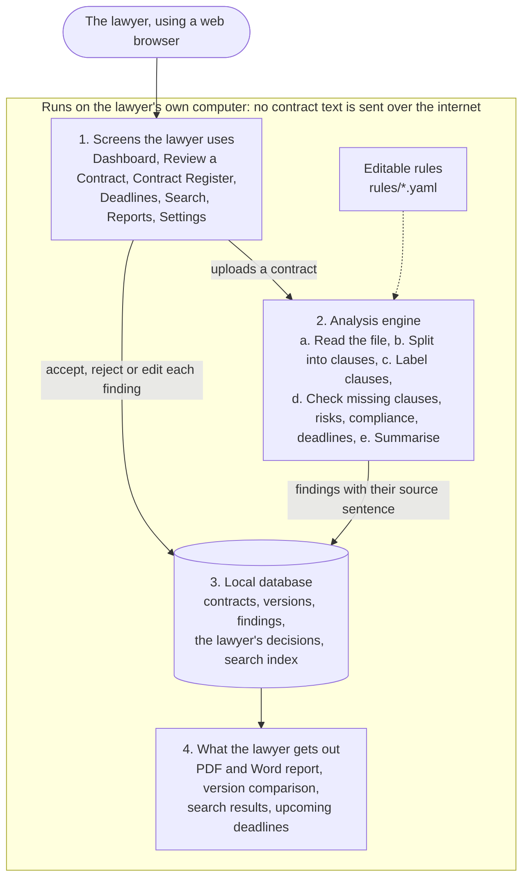

# Report hand-off pack: LexReview NG

Prototype for the capstone project "AI-Driven Contract Review and Management System Developed with Python NLP Libraries for Nigerian Law Firms".

Everything below was checked against the code and the running app on 5 October 2026 (repository commit after `0249b77`). Where a feature is partial or missing, it says so. Figures in section F come from running the system on the synthetic sample contracts; they are demonstration outputs, not accuracy measurements.

## A. Overview

LexReview NG is a contract review and management prototype for Nigerian law firms, built in Python with a Streamlit web interface that runs on the lawyer's own computer. A lawyer uploads a contract (PDF, Word or plain text); the system splits it into clauses, labels each clause by type, flags clauses that are expected but missing, flags risky wording, runs indicative Nigerian compliance checks, extracts obligations and deadlines, and produces an extractive summary. Every result is shown as a suggestion next to the sentence it came from, and the lawyer can accept, reject or edit it. Contracts, versions, findings and decisions are kept in a local SQLite register with keyword search, version comparison and PDF or Word report export.

## B. Technology stack

Python 3.11.15. Versions are the ones installed in the project environment (`.venv`).

| Library or framework | Version | What it is used for |
|---|---|---|
| Python | 3.11.15 | Language runtime |
| Streamlit | 1.65.0 | Web user interface (pages, widgets, navigation, theming) |
| spaCy | 3.8.16 | Tokenisation and `PhraseMatcher` for rule-based clause identification (`core/classify.py`) |
| en_core_web_sm | 3.8.0 | spaCy English pipeline; loaded with the NER and parser components disabled, so only tokenisation and lemma-level features are used |
| pdfplumber | 0.11.10 | Text extraction from PDF files (`core/ingest.py`) |
| python-docx | 1.2.0 | Text extraction from Word files, and Word report export (`core/ingest.py`, `core/report.py`) |
| dateparser | 1.4.3 | Parsing written dates such as "15 November 2026" (`core/obligations.py`) |
| scikit-learn | 1.9.1 | Optional TF-IDF + logistic regression clause classifier, off by default (`core/tfidf.py`) |
| pandas | 3.0.6 | Tables for charts and report previews in the UI |
| Altair | 6.3.0 | Dashboard risk chart and deadlines timeline |
| reportlab | 5.0.1 | PDF report export (`core/report.py`) |
| PyYAML | 6.0.3 | Loading the editable rule files in `rules/` and the settings files |
| sqlite3 (standard library) | SQLite 3.53.1 | Local database, including the FTS5 full-text search index |
| hashlib, hmac, secrets (standard library) | n/a | Optional password lock (salted scrypt hash) |
| difflib (standard library) | n/a | Clause-level version comparison |
| pypdfium2, pdfminer.six | 5.14.0, 20260107 | Installed as dependencies of pdfplumber, not imported directly |
| pytest | 9.1.1 | Unit tests (development only) |
| Playwright | 1.63.0 | End-to-end browser tests and screenshot tools (development only) |

## C. Architecture

### Components and data flow

The app has four layers. The presentation layer (`app.py`, `ui/`) is a Streamlit app with seven pages. The analysis core (`core/`) is plain Python with no UI code; `core/pipeline.py` runs the steps in order. The rules layer (`rules/*.yaml`) holds every pattern, checklist, risk rule and compliance check in editable YAML. The storage layer (`storage/`) is a single SQLite file.

Data flow from upload to report:

1. The lawyer uploads a file on the Review page. `core/ingest.py` extracts and cleans the text.
2. `core/missing.py` detects the contract type from keywords; the lawyer can change it.
3. `core/segment.py` splits the text into clauses and records each clause's character offsets.
4. `core/classify.py` labels each clause using heading keywords and spaCy phrase matching.
5. `core/missing.py`, `core/risk.py`, `core/compliance.py` and `core/obligations.py` produce findings. Every finding that comes from a sentence keeps that sentence and its offsets.
6. `core/summarise.py` builds the extractive summary.
7. `storage/models.py` saves the contract, version, clauses, findings (status "suggested") and obligations to SQLite. A database trigger adds the text to the FTS5 search index.
8. The Review page shows the text with highlights next to finding cards; the lawyer's accept, reject or edit decisions are written back to the database.
9. The Reports page assembles the stored data and decisions and `core/report.py` exports it as PDF or Word.

### Component diagram

The easy-to-read version for the report is `report_handoff/architecture.png` (its source is `report_handoff/architecture.html`, so the wording can be edited). The same structure as Mermaid text:



### Folder and module structure

```
app.py                     Entry point: page setup, stylesheet, sidebar, navigation, optional lock screen
config.yaml                Default settings (firm name, feature flags)
.streamlit/config.toml     Theme, hidden developer menu, telemetry off, listen on localhost only
assets/styles.css          The single stylesheet
static/                    Logos, institution logos, bundled Inter font (so no font is downloaded)
core/ingest.py             Extracts text from PDF, DOCX and TXT and cleans it
core/segment.py            Splits text into clauses (numbered, "Clause N", capitalised or Title Case headings) with offsets
core/nlp.py                Loads the spaCy English pipeline once (NER and parser disabled)
core/rules.py              Loads the YAML rule files
core/classify.py           Labels clauses by heading keywords and spaCy PhraseMatcher phrases; explains each label
core/tfidf.py              Optional TF-IDF + logistic regression fallback for clauses labelled "Other" (off by default)
core/missing.py            Detects the contract type and reports expected clauses that are missing
core/textutil.py           Sentence splitting with character offsets
core/risk.py               Runs the 12 YAML risk rules
core/compliance.py         Runs the 7 indicative Nigerian compliance checks
core/obligations.py        Finds obligations, the obligated party, periods and calculated due dates
core/money.py              Parses Naira amounts into integer kobo
core/summarise.py          Builds the extractive summary
core/pipeline.py           Runs the whole analysis and assembles findings
core/diff.py               Clause-level comparison between two versions
core/report.py             Builds the PDF and Word review reports
core/auth.py               Password hashing and checking for the optional lock (scrypt)
storage/db.py              SQLite schema, FTS5 search index, secure delete settings
storage/models.py          All database reads and writes (register, versions, decisions, search, delete)
ui/state.py                Per-session database connection, settings, cached analysis, sample loader
ui/components.py           Shared UI pieces: page header, badges, finding card, institution band, escaping helpers
ui/highlight.py            Builds the highlighted contract text pane
ui/review_parts.py         Upload form and review workspace helpers
ui/login.py                Optional lock screen and password settings
ui/pages/dashboard.py      Dashboard page
ui/pages/review.py         Review a Contract page
ui/pages/register.py       Contract Register, contract detail, version comparison, delete
ui/pages/deadlines.py      Deadlines timeline and list
ui/pages/search.py         Keyword search page
ui/pages/reports.py        Report preview and PDF / Word export
ui/pages/settings.py       Settings page
rules/clause_patterns.yaml Heading keywords and phrases for 19 clause types
rules/checklists.yaml      Expected clauses for 7 contract types, with a reason for each
rules/risk_rules.yaml      12 risk rules
rules/nigeria_compliance.yaml  7 indicative compliance checks
data/samples/              7 synthetic contracts, a revised supply agreement (versions/), expected.yaml
data/training/clauses.yaml 190 synthetic labelled sentences for the optional TF-IDF model
tests/                     221 unit tests (pytest)
e2e/                       33 end-to-end browser tests and the feature x role coverage matrix
scripts/screenshots.py     Regenerates docs/screenshots (development tool)
docs/                      architecture.md, demo.md, screenshots
```

## D. How each feature works

**Text extraction.** PDF (pdfplumber), Word .docx (python-docx, including table cells and a best-effort rebuild of Word's automatic numbering), and plain text (UTF-8, with a Windows-1252 fallback). Cleaning turns curly quotes and long dashes into plain characters, removes "Page x of y" lines, rejoins words hyphenated across lines and keeps line structure. Files with less than about 200 characters of readable text are refused with a message that a scanned PDF needs OCR; there is no OCR. Older .doc files are not supported.

**Clause segmentation and identification.** This is rule-based, with an optional machine learning fallback. Segmentation uses line patterns: "1.", "1.1", "Clause 5:", "Article 3", capitalised headings and Title Case headings; "(a)" items stay inside their clause. Identification scores each clause against heading keywords and phrases in `rules/clause_patterns.yaml` (199 phrases) using spaCy's PhraseMatcher, and the highest score wins. There is no trained model in the default path. The recognised types are Parties, Definitions, Term, Payment, Termination, Confidentiality, Indemnity, Limitation of Liability, Governing Law, Dispute Resolution, Force Majeure, Data Protection, Assignment, Notices, Intellectual Property, Non-Compete, Rent, Repayment, Service Levels, and Other. An optional TF-IDF and logistic regression model (scikit-learn, trained in memory on 190 synthetic sentences) can relabel clauses the rules left as "Other". It is off by default and enabled in Settings.

**Missing clause detection.** `rules/checklists.yaml` lists the expected clauses for each contract type, with a one-sentence reason for each. Checklists exist for seven types: employment, commercial supply, lease, NDA, partnership, service level and loan agreements. The contract type is detected from keywords (title words count five times) and the lawyer can override it. Missing governing law, dispute resolution, termination or data protection clauses are High; other missing clauses are Medium. If a document cannot be split into at least two clauses, missing-clause findings are suppressed and a warning is shown instead.

**Risk analysis.** Twelve rules in `rules/risk_rules.yaml`, each with a plain-English reason and the source sentence:

| Rule | Severity |
|---|---|
| Uncapped Liability | High |
| Termination Without Notice | High |
| Foreign Governing Law | High |
| No Governing Law | High |
| Foreign Arbitration (seat outside Nigeria, LCIA or ICC) | High |
| Missing Data Protection (personal data mentioned, no data protection clause) | High |
| High Interest Rate (above 2% per month or 36% per annum) | High |
| One-Sided Indemnity | Medium |
| One-Sided Termination | Medium |
| Auto-Renewal Without Notice | Medium |
| No Dispute Resolution | Medium |
| Penalty Clause | Medium |

No rule currently uses the Low severity level, although the system supports it.

**Nigerian compliance checks.** Seven indicative checks in `rules/nigeria_compliance.yaml`. Each result is Pass or a flag, carries the statute it refers to, and ends with "Indicative check only. This is not legal advice; confirm against current Nigerian law."

| Check | Applies to | Severity if failed |
|---|---|---|
| Governing law names Nigeria | All | High |
| Nigeria Data Protection Act 2023 referenced where personal data appears | All (when personal data is mentioned) | High |
| Arbitration and Mediation Act 2023 referenced where arbitration is chosen | All (when arbitration is mentioned) | Medium |
| Stamp duty and registration reminder | Leases and loans | Medium |
| Labour Act referenced | Employment | Medium |
| Notice period stated | Employment | Medium |
| Termination clause present | Employment | High |

**Obligation and deadline extraction.** Sentences with "shall", "must", "will", "agrees to" or "undertakes to" are candidates; definitions and "shall be governed by" sentences are skipped. The obligated party is matched against the roles the contract defines ("hereinafter referred to as the Lender"). Periods such as "within 30 days of the Drawdown Date" are converted to a calendar date when the anchor date is stated in the text (agreement date, commencement date, defined dates such as the Drawdown Date, expiry date), including business days. Periods tied to events (termination, a written request) are listed without a due date.

**Summarisation.** Extractive only; no text is generated. The summary shows the title, parties and roles, agreement, effective and expiry dates, the largest Naira amount, the term sentence, one key sentence each for payment, rent, repayment, termination, governing law and dispute resolution, and the top five risks and obligations.

**Contract register and lifecycle tracking.** Each contract is stored with title, type, parties, status, effective and expiry dates and value (integer kobo). The register can be filtered by title, type, status, party and expiry window. Status (Draft, Under Review, Executed, Active, Expiring, Terminated) is **set manually by the lawyer**; it does not change automatically, for example to "Expiring" as the expiry date approaches. Deadlines are shown on the Dashboard (next 30 days) and the Deadlines page (30, 60 or 90 days, optional overdue). **There are no reminders that reach the lawyer outside the app** (no email, notifications or calendar export).

**Keyword search, version control, report export.**
- **Search:** built. It is an SQLite FTS5 full-text index over all stored versions, with highlighted snippets.
- **Version control:** built. A new upload can be saved as the next version of an existing contract, and the register shows a side-by-side clause comparison with word-level highlights. Only the extracted text of each version is stored, not the original file.
- **Report export:** built. Reports are PDF (reportlab) and Word (python-docx), with a cover block, firm name, disclaimer, summary, clauses, missing clauses, risks, compliance, obligations and the lawyer's decisions.

**Human-in-the-loop features.** Every finding (clause label, missing clause, risk, compliance check, obligation) starts with the status "Suggestion". Each card has Accept, Reject and Edit (corrected text) buttons and a note field; decisions are stored and appear in the report. Every finding that comes from text shows its source sentence, and "Show in text" scrolls the contract pane to that sentence and highlights it. Missing-clause findings and failed compliance checks have no source sentence, because they are about something absent. A progress bar shows how many findings have been reviewed.

**Security and privacy.** All analysis runs locally in the Python process on the lawyer's computer.
- **Code search results:** we searched the application code (`app.py`, `core/`, `storage/`, `ui/`, `rules/`, `assets/`, `.streamlit/`, `config.yaml`) for HTTP clients and URLs (`requests`, `urllib`, `http.client`, `socket`, `httpx`, `aiohttp`, `fetch`, `http://`, `https://`). The only match is a code comment explaining why Markdown images are escaped. No external API is called.
- **Telemetry and fonts:** Streamlit's usage statistics are switched off (`gatherUsageStats = false`), and the font and logos are bundled locally.
- **Network exposure:** the server listens on `localhost` only, so other machines on the network cannot open it.
- **Other safeguards:** all SQL is parameterised; contract text is HTML-escaped and Markdown-escaped wherever it is displayed; deleting a contract also purges its words from the search index, and a test checks the raw database file afterwards. The optional password is stored only as a salted scrypt hash in a file excluded from Git.
- **Caveats:** internet access is needed once at installation (pip packages and the spaCy model download). The database file is not encrypted at rest. We did not monitor network traffic at packet level; the claim above rests on the code search and configuration.

## E. Feature-to-survey mapping

| Survey feature | % of respondents wanting it | Implemented? | Module or file |
|---|---:|---|---|
| Automatic clause identification | 97.2 | Yes | `core/segment.py`, `core/classify.py`, `rules/clause_patterns.yaml` |
| Risk analysis | 93.1 | Yes | `core/risk.py`, `rules/risk_rules.yaml` |
| Missing clause detection | 93.1 | Yes | `core/missing.py`, `rules/checklists.yaml` |
| Compliance checking | 87.2 | Partial: indicative checks only (7 rules); the system finds references and clauses and does not interpret the law | `core/compliance.py`, `rules/nigeria_compliance.yaml` |
| Contract summarisation | 84.4 | Yes (extractive) | `core/summarise.py` |
| Deadline reminders | 83.8 | Partial: deadlines are calculated and shown on the Dashboard and Deadlines page, but no reminders are sent | `core/obligations.py`, `ui/pages/deadlines.py` |
| Smart document storage | 82.9 | Partial: register with metadata, full text and versions; original files are not stored and status is manual | `storage/db.py`, `storage/models.py`, `ui/pages/register.py` |
| Report generation | 82.2 | Yes (PDF and Word) | `core/report.py`, `ui/pages/reports.py` |
| Keyword search | 78.2 | Yes | `storage/db.py` (FTS5), `ui/pages/search.py` |
| Version control | 75.4 | Yes | `storage/models.py`, `core/diff.py`, `ui/pages/register.py` |

## F. Demonstration results

Run on the synthetic sample contracts in `data/samples/` with default settings (TF-IDF fallback off). "Clauses identified" is the number of clause segments, and in brackets how many received a type other than "Other". These are demonstration outputs on contracts we wrote ourselves, with risks and gaps planted on purpose; they are not accuracy figures.

| Sample | Type detected | Clauses identified | Missing clauses flagged | Risks flagged | Obligations (with calculated due date) |
|---|---|---|---|---|---|
| employment_agreement.txt | Employment Agreement | 38 (29 typed) | Dispute Resolution (High) | Termination Without Notice (High); One-Sided Termination (Medium); No Dispute Resolution (Medium) | 18 (2): 15 Dec 2026 and 31 Dec 2026, both owed by the Employer, within 14 and 30 days of the commencement date |
| supply_agreement.txt (commercial) | Commercial / Supply Agreement | 40 (36 typed) | Notices (Medium) | High Interest Rate (High); Uncapped Liability (High); Foreign Governing Law (High); Foreign Arbitration (High); One-Sided Indemnity (Medium); Auto-Renewal Without Notice (Medium) | 12 (0) |
| lease_agreement.txt | Lease / Tenancy Agreement | 14 (12 typed) | Assignment (Medium) | Penalty Clause (Medium) | 21 (1): 19 Sep 2026, first year's rent within 14 days of execution; party not identified ("Unspecified") |
| nda.txt | Non-Disclosure Agreement | 29 (24 typed) | Data Protection (High) | Missing Data Protection (High); One-Sided Indemnity (Medium) | 9 (0): all periods are tied to events such as a request |
| loan_agreement.txt | Loan Agreement | 48 (40 typed) | Notices (Medium) | High Interest Rate (High); Termination Without Notice (High); One-Sided Termination (Medium) | 14 (2): 16 Nov 2026 (Borrower, security documents) and 15 Dec 2026 (first instalment, party not identified) |
| partnership_agreement.txt | Partnership Agreement | 49 (41 typed) | Confidentiality (Medium) | None | 23 (1): 31 Dec 2026, each partner pays capital |
| service_level_agreement.txt | Service Level Agreement | 56 (53 typed) | None | None | 28 (1): 15 Nov 2026, Provider assigns an account manager |

Nigerian compliance results on the same runs:
- **Employment:** Data Protection Act not referenced (High); Labour Act not referenced (Medium). Nigerian governing law, notice period and termination clause all Pass.
- **Supply:** governing law not Nigerian (High); Arbitration and Mediation Act not referenced (Medium).
- **Lease:** stamp duty reminder (Medium). Governing law and Arbitration and Mediation Act Pass.
- **NDA:** Data Protection Act not referenced (High). Governing law Pass.
- **Loan:** stamp duty reminder (Medium). Governing law Pass.
- **Partnership:** Arbitration and Mediation Act not referenced (Medium). Governing law Pass.
- **Service level agreement:** all three applicable checks Pass.

The deliberately planted risks and gaps listed in `data/samples/expected.yaml` are all found, and the unit tests check this. Some clause labels are imperfect; for example, "Supply of Products" clauses in the supply agreement are labelled Service Levels.

## G. Interface design

The app has seven pages in a fixed sidebar: Dashboard, Review a Contract, Contract Register, Deadlines, Search, Reports and Settings.
- **Dashboard:** carries the capstone title and both institution logos, KPI cards, upcoming deadlines, a risk chart and recent activity.
- **Review a Contract:** a two-pane workspace with the highlighted contract text on the left and six tabs of finding cards on the right (Summary, Clauses, Missing clauses, Risks, Nigerian compliance, Obligations and deadlines).

Design choices:
- **Trust:** every finding shows a plain-English reason and its source sentence; "Show in text" jumps to it; clause labels show the words that produced them; severity is always a word plus a colour (High red, Medium amber, Low blue, Pass green); and every finding is labelled "Suggestion" until the lawyer decides.
- **Ease of use:** each page has a title, a one-line description and at most one primary action. A restrained navy, gold and grey palette, a fixed type scale and plain-English empty states are used throughout.
- **Security:** a sidebar badge states "Runs locally. Your documents never leave this computer.", a disclaimer is always visible, deleting a contract or all data needs confirmation, and there is an optional password lock.

## H. Known limitations

- **No formal evaluation.** No precision, recall or user study has been done; the system has only been demonstrated on seven synthetic contracts written for this project.
- **Rule coverage.** Labels and risks depend on keywords and phrases in YAML. Unusual drafting, clauses that mix topics and heavy cross-referencing can be mislabelled; a few sample clauses are labelled imperfectly. Only 12 risk rules and 7 compliance checks exist.
- **Untested formats.** No real client contracts, scanned PDFs (no OCR), multi-column layouts, legacy .doc files or non-English contracts have been tested. Word auto-numbering is rebuilt on a best-effort basis.
- **Optional ML fallback is weak.** It is trained on only 190 synthetic sentences.
- **Deadlines need an anchor date in the text.** No reminders are sent outside the app.
- **Lifecycle status is manual.** Original files are not stored, only their extracted text.
- **Compliance checks are indicative.** They look for references and clauses and do not interpret the law; they need maintaining as the law changes.
- **Single user on one computer.** There are no user accounts or roles, the password lock is a simple lock screen, and the database is not encrypted at rest.

## I. How to run it

Requires Python 3.11. Internet is needed once, for installation.

```bash
git clone https://github.com/mtor24/contract-review-ng.git
cd contract-review-ng
python -m venv .venv
# Windows:
.venv\Scripts\activate
# macOS or Linux:
source .venv/bin/activate
pip install -r requirements.txt
streamlit run app.py
```

Open http://localhost:8501. In Settings, click "Load sample contracts" to load the seven samples.

To run the tests:

```bash
pip install -r requirements-dev.txt
python -m pytest -q                  # 221 unit tests
python -m playwright install chromium
python -m pytest e2e -q              # 33 end-to-end browser tests
```

To regenerate this pack's screenshots and diagram: `python report_handoff/capture.py`.
